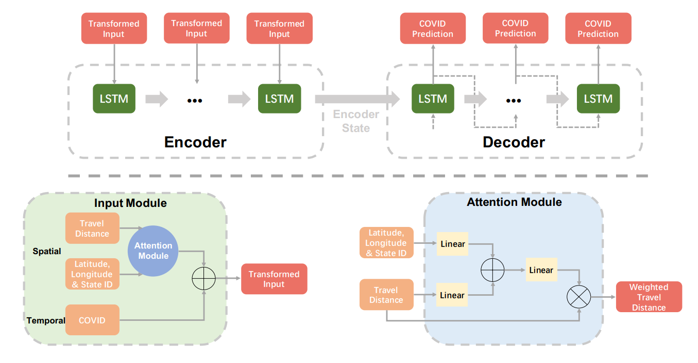

## The impact of spatio-temporal travel distance on epidemics using an interpretable attention-based sequence-to-sequence model




### Installation

- This code requires Tensorflow 2.6.0 and python 3.7. Please install dependencies by

  ```shell
  pip install -r requirements.txt
  ```

- Clone this repo.

  ```shell
  git clone https://github.com/tingT0929/S2SEA-Net.git
  ```


### Data Preparation

- Our data source consists of the daily number of new cases and deaths from late January 2020 to November 13, 2021 which were collected from [New York Times](https://github.com/nytimes/covid-19-data/tree/master/rolling-averages). 
- The daily number of the population taking trips for four classes of travel distances at the same periods as epidemic data was collected from https://www.bts.gov/daily-travel.
- Here is the [data demo](./dataset).


### Train

- Modify paramter values in `./config/default.py` or `./config/cfg.yaml`

- Start the training process by

  ```shell
  python main.py --opts network "CoviFacAttn2" data.pred_steps 7
  ```

  
